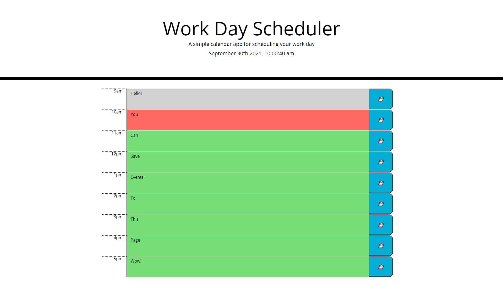

# 3-1-hw-work-day-scheduler

## Description
This application allows users to input and save events to local storage which will persist if the page is reloaded. The text area of the input will also change color depending on the time of day. Grey means that the current time has passed those hours, red is the current active hour, and green is future hours. 

There is also a time and date at the top of the page, which refreshes every second. 

## Deployed Application
https://jasonluxie.github.io/3-1-hw-work-day-scheduler/

## Application Demonstration
Full application with saved event values. Each button saves the content of it's adjacent text input.

<kbd></kbd>
## Notes
Built with:
* Modal.js
* Jquery
* Bootstrap